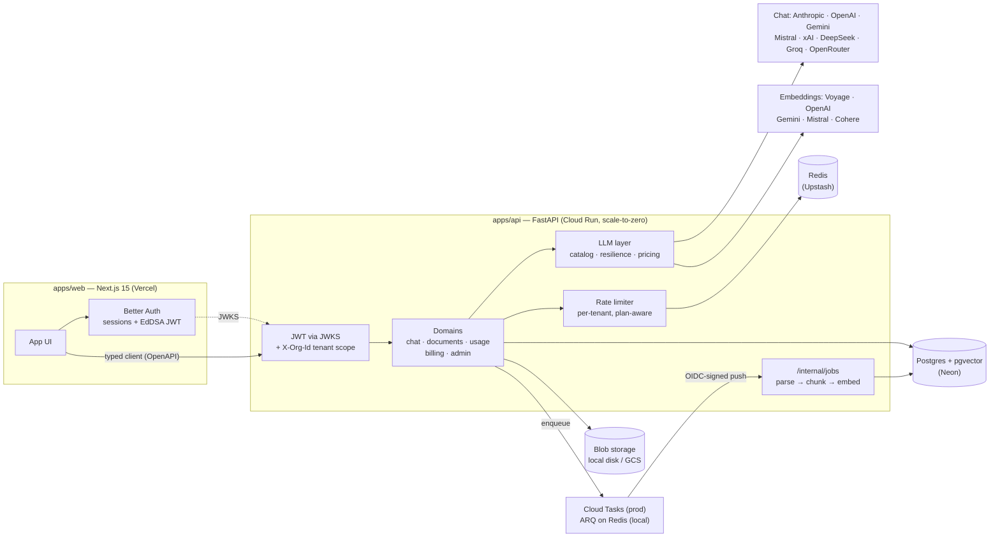

# saas-genai-starter

[](https://github.com/delmalih/saas-genai-starter/actions/workflows/ci.yml)
[](LICENSE)
[](https://saas-genai-starter-web.vercel.app)

**A production-grade, open-source starter for multi-tenant GenAI SaaS** — the
parts demo-grade starters ignore: multi-tenancy enforced at the data layer,
LLM cost tracking per organization, provider resilience, bring-your-own-key
support for 8 chat providers, observability, async ingestion, an eval harness
that caught real bugs before launch, and a $0/month deployment.

Built with **Next.js 15 · FastAPI · PostgreSQL + pgvector · Terraform**.

## ✨ Try it now

**[saas-genai-starter-web.vercel.app](https://saas-genai-starter-web.vercel.app)**
— sign up, paste your own API key (Anthropic, OpenAI, Gemini, Mistral, xAI,
DeepSeek, Groq or OpenRouter) in *Settings → AI Provider*, upload a PDF and
chat with it. Streamed answers, page-level citations, live cost tracking.

The demo runs the exact code in this repo on infrastructure that costs its
maintainer **0€/month** (details [below](#the-0month-deployment)). Your keys
are Fernet-encrypted at rest and write-only through the API.

## What's inside

- **Multi-tenancy you can't bypass** — every query goes through a
  tenant-scoped repository that injects the filter at construction;
  forgetting it is structurally impossible. Cross-tenant isolation has
  dedicated tests.
- **Auth done right** — [Better Auth](https://better-auth.com) in Next.js
  (email/password + Google/GitHub SSO, env-gated), FastAPI validates its
  JWTs via JWKS. Roles (owner/admin/member), team invitations with
  single-use hashed tokens.
- **Bring-your-own-key, multi-provider** — each organization picks its
  provider (Anthropic, OpenAI, Google Gemini, Mistral, xAI, DeepSeek, Groq
  or OpenRouter for chat; Voyage, OpenAI, Gemini, Mistral or Cohere for
  embeddings), its model, and pastes its own API keys — encrypted at rest
  (Fernet), write-only through the API, never logged. Server-wide env keys
  remain as the self-host fallback, and OpenAI-compatible providers are a
  [catalog entry away](docs/extending-llm-providers.md).
- **LLM costs under control** — every call (chat, RAG, ingestion,
  extraction) writes a usage row: tokens (including cache reads), cost in
  USD from a versioned pricing table, latency, status. Usage survives
  client disconnects and mid-stream failures. A dashboard shows daily
  spend per feature and model.
- **Resilience as a layer, not an afterthought** — provider-agnostic
  retries with jitter, `retry-after` honored, circuit breaker with
  half-open probes (429s don't trip it — throttling isn't an outage).
- **RAG pipeline** — async ingestion (parse → chunk with page numbers →
  embed → pgvector HNSW), agentic chat with a search tool, citations
  persisted with messages, per-tenant rate limiting (Redis, fail-open),
  structured-output metadata extraction.
- **Observability** — OpenTelemetry traces (FastAPI/SQLAlchemy/httpx +
  `llm.call` spans carrying model, tokens and cost), structured logs with
  request and tenant ids.
- **Evals from day one** — `make evals` runs the real pipeline against a
  fixture corpus and scores it with an LLM judge. Current baseline:
  **0.96 overall** (faithfulness 0.99, citations 0.93) on
  `claude-sonnet-4-6`. The first run scored 0.57 and exposed two real
  bugs — see [Why these choices](#why-these-choices).
- **Billing, opt-in** — Stripe subscriptions (Checkout + customer portal +
  signature-verified webhooks) behind a `BILLING_ENABLED` flag, with
  plan-based rate limits (free/pro) and upgrade prompts when quotas are
  hit. Off by default: no Stripe code runs and no Stripe account is
  needed.
- **Agent-bootstrappable** — point Claude Code (or any coding agent) at
  [`BOOTSTRAP.md`](BOOTSTRAP.md) with five parameters and it turns the
  starter into *your* named, branded product with green tests
  (`make bootstrap` for humans).

## Architecture



Background jobs need no always-on worker in production: the API enqueues a
Cloud Tasks task, which pushes an OIDC-signed HTTP request back to the same
scale-to-zero service. Locally the same job code runs on an ARQ worker —
the queue is an interface, the swap is configuration.

## The $0/month deployment

The [Terraform in `infra/`](infra/terraform) deploys the whole stack inside
free tiers, with CI/CD included:

| Piece | Service | Why it's free |
|---|---|---|
| API | Cloud Run | scale-to-zero, CPU billed only while serving |
| Jobs | Cloud Tasks | push queue — no idle worker to pay for |
| Database | Neon Postgres | serverless free tier, pgvector included |
| Rate limiting | Upstash Redis | free tier, per-request pricing model |
| Documents | GCS | always-free tier (US regions) |
| Web | Vercel Hobby | static + serverless |
| LLM usage | — | every org brings its own keys |
| CD | GitHub Actions | keyless deploys via Workload Identity Federation |

`git push` on `main` builds the image, runs Alembic against Neon (connection
string fetched from Secret Manager, masked in logs), deploys the new
revision and smoke-checks `/health` — no JSON service-account keys anywhere.

## Quickstart

**Prerequisites**: Node ≥ 22, pnpm (`corepack enable pnpm`),
[uv](https://docs.astral.sh/uv/), and a Docker runtime (Docker Desktop or
`brew install colima docker-compose && colima start`).

```bash
git clone https://github.com/delmalih/saas-genai-starter && cd saas-genai-starter
make setup    # deps + .env files
make migrate  # database schema
make dev      # postgres+redis (docker), API on :8000, web on :3000
make worker   # in a second terminal — document ingestion
```

Sign up on http://localhost:3000, then either:
- paste your provider key in *Settings → AI Provider* (per-organization,
  encrypted at rest), or
- set server-wide keys in `apps/api/.env` (`ANTHROPIC_API_KEY`,
  `VOYAGE_API_KEY`, …) as the fallback for every org.

For RAG you also need an embeddings key: **Voyage AI** (free tier) with
Anthropic, or your OpenAI/Gemini/Mistral key covers both.

**Making it yours**: [`BOOTSTRAP.md`](BOOTSTRAP.md) — written for coding
agents — renames, rebrands and re-domains the starter from five parameters.

## Evals

```bash
make evals                      # full run, ~7 min (paced for Voyage free tier)
make evals ARGS="--min-score 0.8"
```

The harness ingests a fixture corpus with **real embeddings** into a
dedicated database, runs the **real agent loop**, and grades every answer
with an LLM judge on faithfulness and citation correctness — including
negative cases where the right answer is "that's not in the documents".
Per-commit results land in [`evals/results/`](evals/results/).

| Metric | Baseline (claude-sonnet-4-6) |
|---|---|
| Overall | **0.963** |
| Faithfulness | 0.993 |
| Citation correctness | 0.933 |

## Why these choices

The decisions that make this starter production-grade rather than demo-grade
— several were validated the hard way:

- **Tenant isolation lives in the repository layer, not in code review.**
  `TenantScopedRepository` takes the tenant at construction and injects the
  filter into every query; `add()` overwrites forged tenant ids. You can't
  forget a `WHERE tenant_id = ...` because you never write one.
- **`lazy="raise"` on every relationship.** Async SQLAlchemy turns implicit
  lazy loads into `MissingGreenlet` errors that depend on garbage-collection
  timing. A flaky test traced back to exactly that — now any unloaded
  relationship access fails loudly and deterministically, and eager loading
  is explicit.
- **The eval harness paid for itself on day one.** First run: 0.57. It
  exposed that tool results sent the model a 400-char UI snippet instead of
  full chunk content (the agent cited the right document while claiming the
  information wasn't there), and that the agent answered general-knowledge
  questions from memory without searching. Both fixed; baseline 0.96. No
  unit test could have caught either.
- **Usage rows survive failure.** Provider costs are incurred even when the
  client disconnects mid-stream — so usage records are written and committed
  on the error path, with output estimated from streamed characters.
- **429 ≠ outage.** Rate limiting is backpressure with its own pacing
  (`retry-after`); only real failures (5xx, timeouts) feed the circuit
  breaker.
- **BYO keys are write-only.** Org API keys are Fernet-encrypted at rest and
  the API only ever returns `is_set` + the last 4 characters. A database
  leak does not leak provider keys.
- **One normalized message format, many providers.** Domain code speaks one
  block vocabulary; each provider translates to its own dialect. The agent
  loop runs unchanged on Claude, GPT, Gemini, Mistral, Grok and friends —
  and a parameterized test enforces the new-provider checklist (pricing
  entry, key column, settings field) straight from the catalog.
- **Queues and storage behind interfaces.** ARQ/local-disk for dev,
  Cloud Tasks/GCS adapters for prod — swapping is configuration, not
  refactoring.

## Project structure

```
apps/
├── web/          # Next.js 15 — Better Auth, typed OpenAPI client, chat UI
└── api/          # FastAPI — src/core (auth, tenancy, telemetry),
                  #           src/llm (catalog, providers, resilience, pricing),
                  #           src/domains (chat, documents, usage, billing, admin, ...)
evals/            # eval harness, fixture corpus, per-commit results
infra/terraform/  # the $0-tier deployment (modules + demo environment)
BOOTSTRAP.md      # agent-driven "make it yours" guide + scripts/bootstrap.py
```

More docs: [extending the LLM layer](docs/extending-llm-providers.md) ·
[auth flow](docs/auth-flow.md) · [deployment](docs/deploy.md) ·
[backlog & decisions](tech-steps.md)

## Status

**v1 is live** — [demo](https://saas-genai-starter-web.vercel.app) deployed
from this repo, CI green, eval baseline 0.96. The full build history is
ticket-by-ticket in [`tech-steps.md`](tech-steps.md), including the
decisions and the post-launch roadmap.

## License

[MIT](LICENSE)
