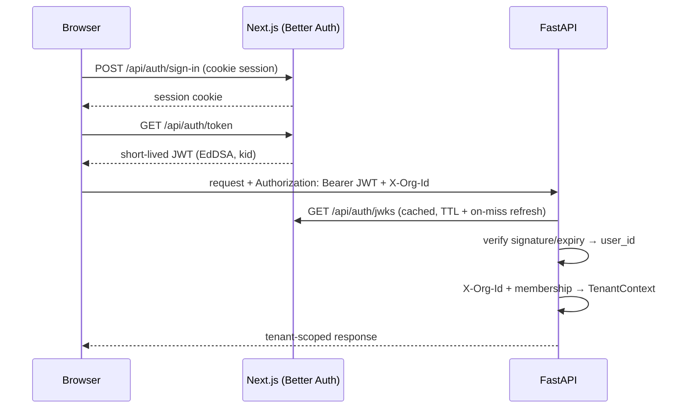

# Auth flow

Authentication lives in the **web app** (Better Auth); the **API** only
verifies. They share one Postgres server but the auth tables sit in a
dedicated `auth` schema that the API never writes to.

Key properties:

- **The API holds no credentials.** It trusts Better Auth's JWKS endpoint;
  key rotation is handled by the kid-based cache refresh.
- **The JWT proves identity, the `X-Org-Id` header selects the workspace** —
  and is verified against the membership table on every request
  (`get_current_tenant`). Non-members get a 404, not a 403, so org ids leak
  nothing.
- **Member emails** shown in the UI are resolved by a read-only query
  against the `auth` schema — the API never joins it for authorization.
- The Next.js middleware does an optimistic cookie check for routing; real
  enforcement is always server-side (Better Auth) and API-side (JWT).
